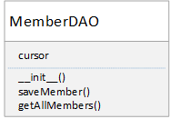

# TennisDAO Example

The following example uses the Data Access Objects design pattern to create a set of objects that will allow programmers to save objects to the database without using SQL. The Member class, the TennisGUI class and the MemberDAO class have been supplied for you but your job is to add two functions to the MemberDAO class to make the overall application work.

The following assignment has the following objectives
- To introduce the concept of a Design Pattern as a way to organise Classes and objects effectively
- To allow learners to develop a further understanding of embedded SQL
- To understand the benefits of abstracting away the SQL complexity to make it easier for future programmers and application designers to integrate with a database
- To build an abstraction layer to control access to and secure the database

The functions you should add are to be called saveMember(member) and getAllMembers() as per the following UML description of the class.

The TennisGUI.py class has been provided for you. You do not need to make any changes to this class but once you have completed part 1 and 2 successfully, this GUI will work properly allowing the user to add new Members and to Return the Complete list of members from the tennis club.

# Part 1

The saveMember(mebmer) function should take one argument containing a Member object. The function should then use the getters to pull the firstname, surname, dateofbirth and membertype from the object. These should then be used to construct a SQL insert into string which in turn should be executed against the connection in order to add the Member's details to the database.

# Part 2

The getAllMembers() function should take no arguments(other than self). The function should execute a SQL query on the database connection which will retrieve a database cursor. The function should then loop through the cursor object, constructing a new Member object each time which will in turn be added to a list. When the loop is complete the list should be returned from the function
